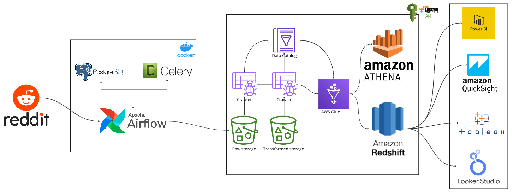

# Reddit-Data-Engineering
A data engineering project that builds end-to-end data pipelines for loading Reddit data into a Redshift data warehouse.

## Overview
The pipeline contains the following components:
1. Extract data from Reddit using its API.
2. Store the raw data into an S3 bucket from Airflow.
3. Transform the data using AWS Glue and Amazon Athena.
4. Load the transformed data into Amazon Redshift for analytics and querying.

## Architecture

## Data Source
The data comes from Reddit API and contains responses and their properties (title/scores/number of comments/etc.) regarding the data engineering topic on Reddit.

## Airflow Dag
The Airflow dag script can be found [here](dags/reddit_dag.py).

## Pipeline Script
The pipeline script can be found [here](https://github.com/brunoxie/Reddit-Data-Engineering/tree/main/pipelines).

## Data Location
The output data can be found [here](data/output).

## Reference
https://github.com/airscholar/RedditDataEngineering/tree/main
